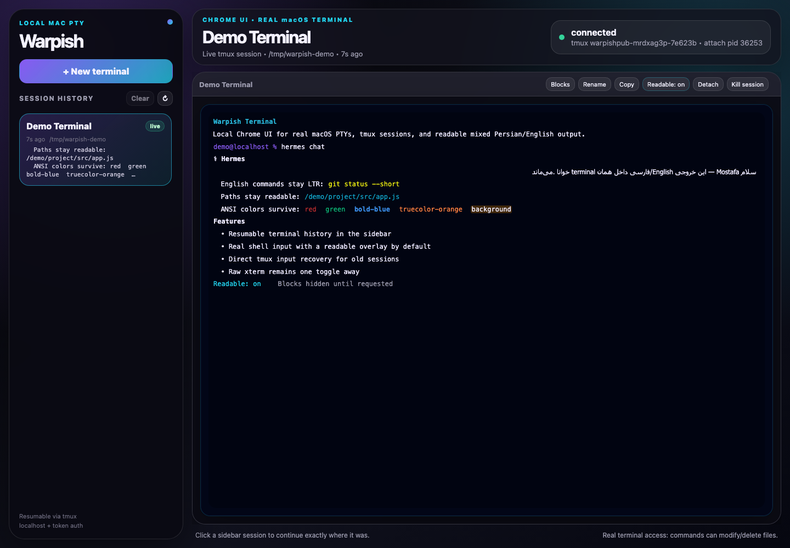

# Warpish Terminal

Local-only Chrome web terminal for macOS, with Warp-like resumable terminal sessions.



What it does:
- Opens a modern Chrome UI with a left sidebar.
- Sidebar shows terminal session history with live/stopped state and recent preview.
- Click a live session to continue it; create a new terminal with `+ New terminal`.
- Clear stopped history from the sidebar without killing any live `tmux` sessions.
- Uses real macOS PTYs and `tmux`, so browser reloads/switches do not kill the shell.
- Adds Warp-style command blocks for new sessions; the block panel is hidden by default and opens only when you ask for it.
- Uses a terminal-native layout: normal xterm input goes to the real shell, while input echo and output are shown through a default readable terminal mask. When an LTR shell prompt is followed by Persian/Arabic input, the prompt stays LTR and the typed suffix becomes a compact Word-style RTL segment; English commands, paths, flags, and code stay isolated LTR islands. The readable surface keeps typing focus across old-session reattaches, sends readable-mode keystrokes directly to the backing tmux pane when xterm attach input is stale, handles wheel scrolling through tmux-captured history instead of shell history, turns visible `http(s)`/`www` links into safe new-tab anchors, preserves live xterm and tmux-captured ANSI/truecolor styles, dims inline suggestions after the cursor, keeps tmux-captured full-screen/alternate-screen apps such as Hermes visible instead of showing an empty waiting overlay, and throttles redraws to avoid streaming flicker. You can toggle back to raw xterm with `Readable: off` for edge-case TUIs.
- Binds to `127.0.0.1` and requires a random token stored in `.auth-token`.

Requirements:
- macOS
- Node.js
- Python 3
- `tmux`
- Google Chrome

Run:

```bash
git clone https://github.com/MostafaDadkhah/warpish-terminal.git
cd warpish-terminal
npm install
./start.sh
```

Stop the web server:

```bash
cd warpish-terminal
./stop.sh
```

Note: stopping the web server does not necessarily kill live `tmux` sessions. Use the UI's `Kill session` button to stop a specific terminal session.

Dev/manual:

```bash
cd warpish-terminal
npm start
# open the printed URL in Chrome
```

Tests:

```bash
cd warpish-terminal
npm test
```

`npm run smoke` checks backend/tmux/session behavior. `npm run regression` starts an isolated server plus headless Chrome and guards the readable-terminal regressions that caused previous bugs: Hermes palette ANSI styles, empty-reader blanking, long Hermes scrollback readability, and stale-capture flicker while typing.

Security notes:
- This is equivalent to Terminal.app access. Commands can modify or delete files.
- Default host is `127.0.0.1`; do not bind to `0.0.0.0` unless you add stronger auth/TLS/network allowlisting.
- If you want phone/remote access later, put it behind Tailscale/Funnel or a proper authenticated gateway, not raw public HTTP.
